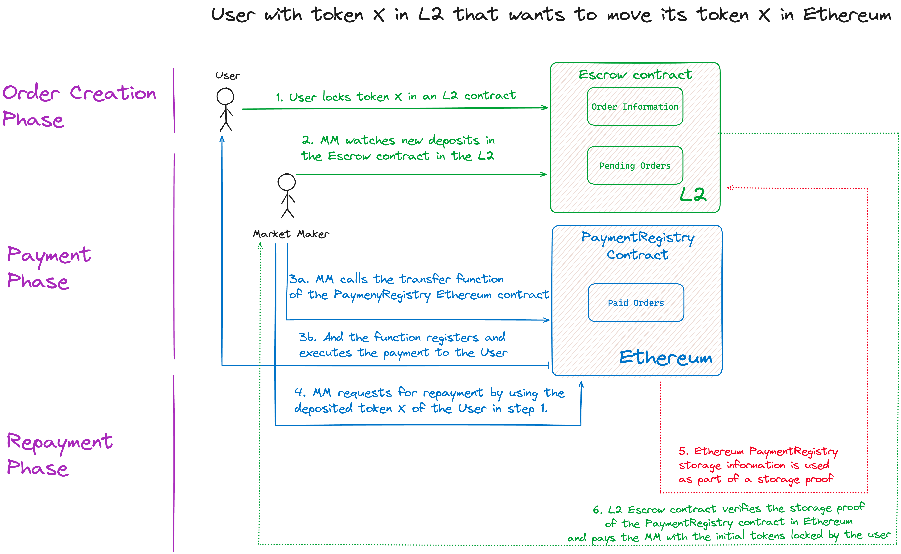

# How it works?

How can we offer a system where the users don't have to trust a facilitator to exchange their assets from an L2 to
Ethereum?

We propose a simple protocol that follows these steps:

1. The user specifies a destination address on Ethereum and locks X tokens
   to be bridged into an L2 escrow smart contract.

2. The market maker is monitoring for a change of state in the escrow smart contract.

3.

   a. The market maker calls the transfer function of the PaymentRegistry Contract in Ethereum.
   
   b. The transfer function of the PaymentRegistry contract in Ethereum pays the X tokens to the user.

4. A storage proof is generated, containing evidence of a transfer from the
   market maker's Ethereum account to the user-specified address in Ethereum.

5. Ethereum PaymentRegistry storage information is then used as part of a storage proof.

6. L2 Escrow contract verifies the storage proof of the PaymentRegistry
   contract in Ethereum and pays the MM with the initial tokens locked by the user.

The same design can be expanded to be used to bridge tokens from an L2 to another L2 and it can include multi-proof
storage proofs instead of using only one.

We also have implemented a fallback mechanism using the native message mechanism
between Ethereum and L2s in case the storage proof providers are offline.

## Fallback mechanism

If the storage proof providers are not available, the market maker can prove
to the Escrow contract that they fulfilled the user's intent through the rollup's
native messaging system. Using this messaging system has the same trust
assumptions as the L2s used in the transfer.

## Risks

For the user, the risks include:

1. The existence of a bug in the code of the smart contract,
2. the existence of a bug in the circuits of the ZK/validity proof verification and the fact that the storage proof
   provider can go offline.

The first risk is mitigated by having a very simple smart contract. 

While the second risk is mitigated by using multi-proof storage proofs and multiple ZK/validity
proof implementations or TEEs. If the storage proof provider goes offline
the fallback mechanism can be used.

The risks for market makers are the same as for users, plus the risk of
reorganization of the chain and the fact that the market maker receives the
same tokens on the L2s rather than on Ethereum.

Since the capital is locked for a short period of time (i.e. until the proof is generated or
the message arrives), the risks are minimized and the attack surface is much smaller
for the market maker.
